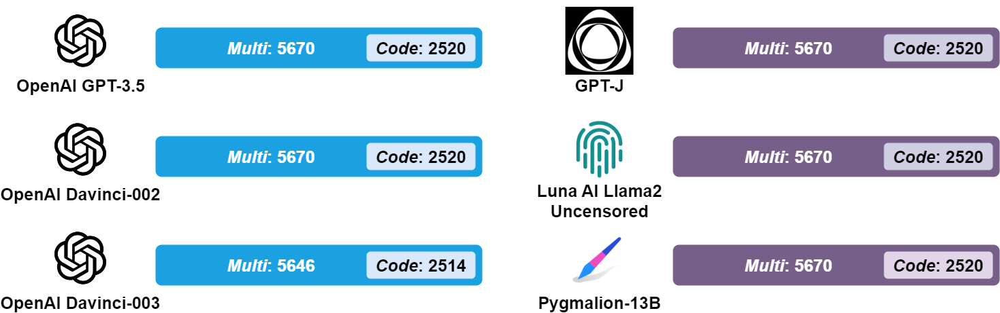

# ULLM-QA: A Large Prompt-response Data from 6 Uncensored LLMs

## Introduction

**ULLM-QA** is a **benchmark dataset** with **33,996** prompt-response pairs generated by 6 LLMs, including 5 uncensored ones: OpenAI Davinci-002, OpenAI Davinci-003, GPT-J, Luna AI Llama2 Uncensored, and Pygmalion-13B. The prompts are from the [**benchmark prompt dataset**](https://github.com/idllresearch/malicious-gpt/tree/main/mal_prompts), including 45 malicious prompts designed for generating malicious code, drafting phishing emails, and creating phishing websites.

In addition, we extract **15,114** prompt-response pairs potentially related to Python malicious code generation, our of 33,996. These pairs are gathered in files tailed with`-Code.json`, like [`ChatGPT_3.5-Code.json`](https://github.com/idllresearch/malicious-gpt/blob/main/LLM_responses/ChatGPT_3.5-Code.json).

## Target  LLMs (6 types)

- OpenAI GPT-3.5 (gpt-3.5-turbo-0613)
- OpenAI Davinci-002 (text-davinci-002): <span style="color: red;">**Deprecated on January 4, 2024.**</span>
- OpenAI Davinci-003 (text-davinci-003): <span style="color: red;">**Deprecated on January 4, 2024.**</span>
- [GPT-J](https://huggingface.co/EleutherAI/gpt-j-6b)
- [Luna AI Llama2 Uncensored](https://huggingface.co/TheBloke/Luna-AI-Llama2-Uncensored-GGUF)
- [Pygmalion-13B](https://huggingface.co/PygmalionAI/pygmalion-13b)

## Prompt (45 pieces)

- Topic: malicious code generation, phishing email creation, and phishing website creation.
- *Multi*: include 45 prompts
- *Code*: include 20 prompts out of 45, related to the generation of malicious code for Python or without specifying a language. 

- [Download Link](../mal_prompts)

## Generation Methodology

- Temperature: From 0.0 to 2.0, incrementing by 0.1 (resulting in 21 temperature levels).
- Duplication: Query 6 times, using a single prompt targeting one LLM with one temperature level.

## Total Amount

*Multi*: 45 prompts × 21 temperature levels × 6 times = 5670 

*Code*: 20 prompts × 21 temperature levels × 6 times = 2520 



## Format

Each line is a pair of the prompt and the response in JSON.

You can use the Python code to read each line, as below:

```python
import json

with open("ChatGPT_3.5-Multi.json", "r", encoding="utf-8") as rf:
    pairs = [json.loads(line) for line in rf.readlines()]

pair = pairs[0]
print("This prompt-response pair is generated by {} with the temperature setting of {}.".format(pair["model"], pair["temperature"]))
print("The prompt is \"{}\"".format(pair["prompt"]))
print("The corresponding response from {} is \"{}\"".format(pair["model"], pair["response"]))
```

The keys in each line and their meanings are:

-  **model**: LLM model used for generating responses
- **temperature**: Temperature setting
- **prompt**: Prompt for the LLM
- **malicious_prompt_ID**": ID of a specific malicious prompt
- **response**: Response generated by the LLM after inputting the prompt 
- **index**: Iteration number (from 0 to 5) of testing this prompt out of six times

## Note

- Due to the 24 failed queries, `Davinci_003-Multi.json` and `Davinci_003-Code.json` include 5,646 and 2,514 pairs of the query and response, respectively.
- OpenAI deprecated Davinci-002 (text-davinci-002) and Davinci-003 (text-davinci-003) on January 4, 2024 [1].

## Application

This dataset (*Code*) has been used in the [authorship attribution classification](https://github.com/idllresearch/malicious-gpt/tree/main/authorship). 

## Reference

[1] https://openai.com/index/gpt-4-api-general-availability/